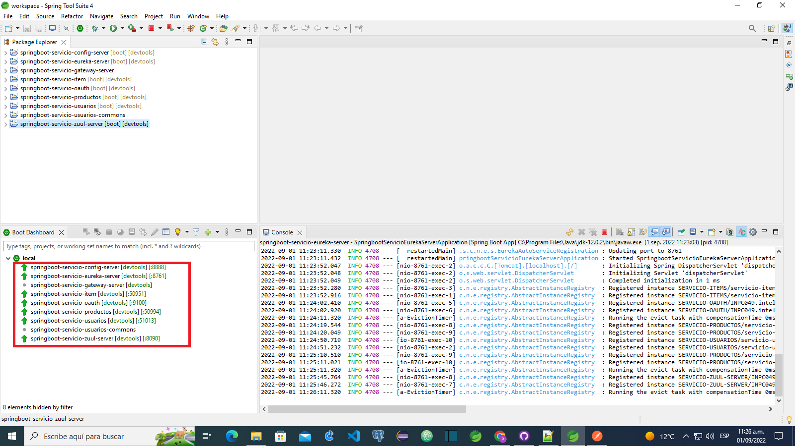

 microservicios-oauth
 
 La intencion de este proyecto es familiarizarse con el ecosistema
 requerido para un crud de usuarios con Oauth, y dos microservicios a modo didactico,
 para usar balanceo de carga y servidor de configuracion de microservicios
 Se le agrego opciones de trazabilidad con zipkin , rabbitMq.
 
 El ecosistema fue desplegado con docker en el local y luego en google cloud platform.

 
 
Microservicios levantados 
 
 
 
 
Eureka 
 

  
Login
  

   
Balanceo de carga 
   

	
	
	
Servidor de configuracion

Ecosistema

	

 
Trazabilidad 

zipkin error de Login 

zipkin tag error 

zipkin Mysql 

rabbitmq 

[Dependencia y configuracion](doc/config-ecosistema.pdf)

 

[Guia para despliegue en google cloud platform](doc/cgp-despliegue-docker-compose.pdf)

 

 
